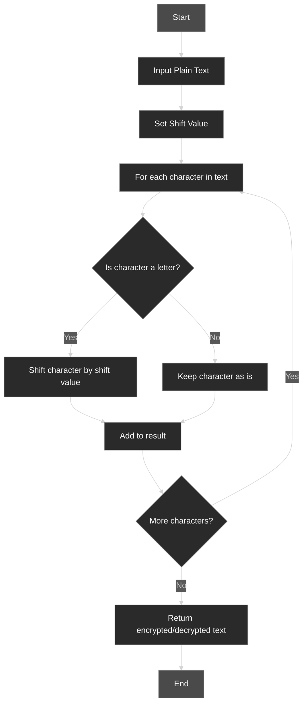
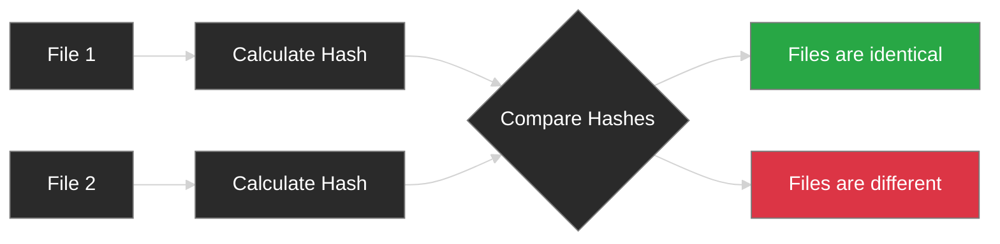

# 🔐 Cryptography and Security Lab

<div align="center">

[](https://git.io/typing-svg)

[](https://www.python.org)
[](https://en.wikipedia.org/wiki/Cryptography)
[](https://opensource.org/licenses/MIT)
[](https://github.com/yourusername/Lab_ATBMTT/stargazers)

<p align="center">

</p>

> 🚀 A comprehensive collection of cryptography and security implementations including Caesar Cipher, Hash Functions, and Binary Analysis tools.

</div>

## 📑 Table of Contents

<details open>
<summary>Click to expand/collapse</summary>

- [✨ Features](#-features)
- [🗂 Project Structure](#-project-structure)
- [🚀 Installation](#-installation)
- [💡 Usage Examples](#-usage-examples)
- [📊 Algorithm Flowcharts](#-algorithm-flowcharts)
- [🌈 Color Reference](#-color-reference)
- [📝 License](#-license)

</details>

## ✨ Features

<div align="center">

| Feature | Description |
|---------|-------------|
| 🔄 Caesar Cipher | Advanced implementation of the classical encryption technique |
| 🔍 Hash Comparison | Secure file integrity verification tools |
| 📊 Binary Analysis | Comprehensive binary file analysis capabilities |
| 🔐 Cryptography | Implementation of fundamental security concepts |

</div>

## 🗂 Project Structure

<details>
<summary>Click to view project tree 🌳</summary>

```bash
Lab_ATBMTT/
├── 📄 binary_hash_compare.py   # Binary file hash comparison
├── 📄 caesar_cipher.py         # Caesar cipher implementation
├── 📁 collision1.bin           # Test file for hash collision
├── 📁 collision2.bin           # Test file for hash collision
├── 📄 hash_compare.py         # Hash comparison utilities
├── 📄 main.py                 # Main program entry point
├── 📄 pyproject.toml         # Project dependencies
└── 📄 sample.txt             # Sample text for testing
```

</details>

## 🚀 Installation

<details>
<summary>Click to view installation steps ⚙️</summary>

```bash
# Clone the repository
git clone https://github.com/yourusername/Lab_ATBMTT.git

# Navigate to project directory
cd Lab_ATBMTT

# Install dependencies
pip install -r requirements.txt
```

</details>

## 💡 Usage Examples

<details open>
<summary>Caesar Cipher Example 🔒</summary>

```python
from caesar_cipher import encrypt, decrypt

# Encrypt a message
encrypted = encrypt("HELLO WORLD", shift=3)
print(encrypted)  # Output: KHOOR ZRUOG

# Decrypt the message
decrypted = decrypt("KHOOR ZRUOG", shift=3)
print(decrypted)  # Output: HELLO WORLD
```

</details>

## 📊 Algorithm Flowcharts

<details open>
<summary>Caesar Cipher Process 🔄</summary>



</details>

<details open>
<summary>Hash Comparison Flow 🔍</summary>



## 📝 License

<details>
<summary>View License Details</summary>

This project is licensed under the MIT License - see the [LICENSE](LICENSE) file for details.

</details>

---

<div align="center">

### 🌟 Star this repository if you find it helpful!


Made with ❤️ for the love of cryptography and security


</div>